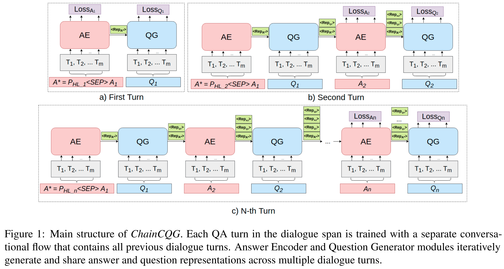

<p align="center"></p>
&nbsp
<h1 align="center">ChainCQG: Flow Aware Conversational Question Generation</h1>

## Overview

ChainCQG is a two-stage architecture that learns question-answer representations across multiple dialogue turns using a flow propagation training strategy.




## Reproduction
1. First we need to download the coqa dataset from [here](https://stanfordnlp.github.io/coqa/), then process it from Question Answer format into Question Generation format. It should be placed in the `/data` folder.

2. We release both ChainCQG and other models benchmarked in the paper. For ChainCQG, please use `run_generation_coqa_chaincqg.sh`. For other models such as `t5` or `bart`, please refer to the `/OtherModel` folder. Changing hyperparameter inside the script should be enough to try other models and settings.


if you find our work useful, please cite:
<!-- ```
@inproceedings{gu-2021-chaincqg,
  title={ChainCQG: Flow-Aware Conversational Question Generation},
  author={Jing Gu, Mostafa Mirshekari, Zhou Yu and Aaron Sisto},
  booktitle={European Chapter of the ACL },
  year={2021},
  url={place holder}
}
```
-->
```
@misc{gu2021chaincqg,
      title={ChainCQG: Flow-Aware Conversational Question Generation}, 
      author={Jing Gu and Mostafa Mirshekari and Zhou Yu and Aaron Sisto},
      year={2021},
      eprint={2102.02864},
      archivePrefix={arXiv},
      primaryClass={cs.AI}
}
```
